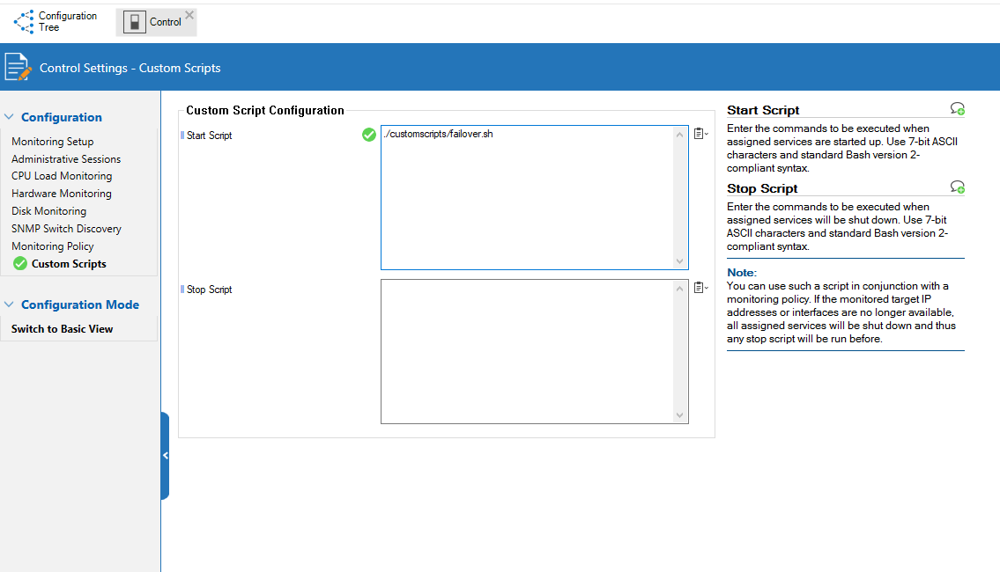

# AWS Multiple IP Failover

## Introduction
This script provides a simple extension of the failover process in AWS that switches the elastic IP address between firewalls. For ease of deployment their are two sub-directories primaryscript and secondaryscript, as each firewall has a unqiue group of private IP addresses the mappings to elastic IP's must be unique.

# Pre-requisit

<ol>
<li>From the AWS EC2 portal, create the required elastic IP address and take a note of their allocation ID's

</li>
<li>In the AWS EC2 portal, assign additional IP addresses to the interface of the Primary Firewall. 
.
<li>In the AWS EC2 portal, assign additional IP addresses to the interface of the Secondary Firewall. 
<li> Make a note of the private IP's of the primary and secondary firewall that you wish to map to the public IP.
 
<table>
<tr><td> Primary Private IP </td><td> Secondary Private IP </td><td>  EIP association ID </td></tr> 
<tr><td> 192.168.1.10 </td><td> 192.168.2.10 </td><td> eipalloc-08201f6beaafcc669 </td></tr> 
<tr><td> 192.168.1.11 </td><td> 192.168.2.11 </td><td> eipalloc-0eb612a7ea78b5771 </td></tr> 
<tr><td> 192.168.1.12 </td><td> 192.168.2.12 </td><td> eipalloc-0a8e01ac3ba79ab71 </td></tr> 
</table>
</li>
<li> prepare the FW rules by pre-creating the dynamic objects, to allow you to create the right type take the project file 'network_object_template.conf' and
copy it into a text editor. For each Elastic IP you wish to associate you must create an object by following the below steps. 
	<ol>
    <li>a) Search for the string "yourassociationid" in the conf file, replace this text with the association ID
    .
    </li>
	<li>b) Once edited Select All into your clipboard</li>
	<li>c) Go to Forwarding Firewall Rules, Network Objects and right click and Paste</li>
    </ol>
You should now have new object entry named after the EIP allocation ID  It is critical all these names match exactly. The entry e.g 'sourceFile={external.eipalloc-08201f6beaafcc669.conf}' is the filename that the script will create on the filesystem of the CGF.</li>
</ol>

## Installation Steps
<ol>
    <li>In a suitable editor modify the contents of /primaryscript/failover.sh to associate your elastic IP allocation ID's to each private IP assigned to the network interface of the primary firewall. </li>
    <li>Now repeat for the script in /secondaryscript/failover.sh, use the same IP allocation ID's but this time change the private IP's to those assigned to the secondary firewall. </li>
    
    <li>With the scripts modified for each filewall to install then, first enable SSH access.  </li>
    <li>On each firewall using the following command create a customscripts directory <code>mkdir /customscripts </code></li>
    <li>Copy the multiip_object_rewrite.py into the new /customscripts directory</li>
    <li>Adjust the permissions on the script <code># chmod 755 /customscripts/multiip_object_rewrite.py</code> </li>

    <li>On the primary firewall copy the the failover.sh located in the primaryscript directory into the /customscripts directory.</li>
    <li>Verify and make sure the script is executable: <code># chmod 755 /customscripts/failover.sh</code></li>
    <li>On the secondary firewall copy the the failover.sh located in the secondaryscript directory into the /customscripts directory.</li>
    <li>Verify and make sure the script is executable: <code># chmod 755 /customscripts/failover.sh</code></li>
    
    <li>To trigger the script on failover, go to Configuration Tree > Infrastructure Services > Control <li>
    <li>Lock the config and enable Configuration Mode - Advanced. </li>
    <li>Go into the new Custom Scripts menu item that has appeared and paste into the Start Script box. . 
        Replace the value CSC - with the name of your firewall if it is in Control Center
        Replace the value of NGFW  - replace with the name of the Firewall Service if you have changed it from default.
     <code> ./customscripts/failover.sh -s="CSC" -f="NGFW" </code> </li>
    <li> The scripts should be ready, now create the objects for them to update. </li>

    <li>Test your script by triggering a failover, if it's working correctly all the Elastic IP's you have allocate should move between firewalls. You can also see the change in the Firewall > Forwarding Rule view
    
    </li>
    
</ol>

## Using the IP's for outbound connections. 
<ol>
<li> To use these for an outbound NAT, create a Connection Object and link it to a single IP, referencing the Network object created e . </li>
<li> . </li>

</ol>

##### DISCLAIMER: ALL OF THE SOURCE CODE ON THIS REPOSITORY IS PROVIDED "AS IS", WITHOUT WARRANTY OF ANY KIND, EXPRESS OR IMPLIED, INCLUDING BUT NOT LIMITED TO THE WARRANTIES OF MERCHANTABILITY, FITNESS FOR A PARTICULAR PURPOSE AND NONINFRINGEMENT. IN NO EVENT SHALL BARRACUDA BE LIABLE FOR ANY CLAIM, DAMAGES, OR OTHER LIABILITY, WHETHER IN AN ACTION OF CONTRACT, TORT OR OTHERWISE, ARISING FROM, OUT OF OR IN CONNECTION WITH THE SOURCE CODE. #####
